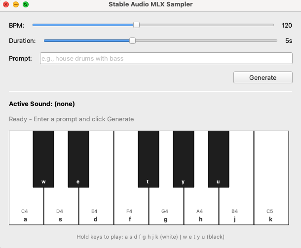

# Stable Audio MLX

Text-to-audio generation using Stability AI's [stable-audio-open-small](https://huggingface.co/stabilityai/stable-audio-open-small) model, optimized for Apple Silicon using the MLX framework.



## Features

- **CLI Audio Generation** (`generate.py`) - Generate audio from text prompts via command line
- **Interactive Sampler UI** (`sampler.py`) - PyQt6-based keyboard sampler for real-time playback

## Setup

### 1. Create Virtual Environment

```bash
python -m venv .venv
source .venv/bin/activate
```

### 2. Install Dependencies

```bash
pip install -r requirements.txt
```

### 3. Get Model Access

The model requires accepting the license on Hugging Face:

1. Visit [stable-audio-open-1.0](https://huggingface.co/stabilityai/stable-audio-open-1.0) and accept the license (name + email required)
2. Visit [stable-audio-open-small](https://huggingface.co/stabilityai/stable-audio-open-small) and accept the license

### 4. Login to Hugging Face

```bash
huggingface-cli login
```

Enter your Hugging Face access token when prompted.

### 5. Download and Convert Model

```bash
python src/conversion/convert.py
```

This will:
- Download `model.safetensors` and `model_config.json` from Hugging Face
- Download T5 text encoder weights
- Convert weights to MLX format (`model/stable_audio_small.npz`)

## Usage

### CLI Audio Generation

Generate audio from a text prompt:

```bash
python generate.py --prompt "warm arpeggios on house beats 120BPM with drums"
```

#### Options

| Option | Default | Description |
|--------|---------|-------------|
| `--prompt` | (required) | Text description of the audio to generate |
| `--negative-prompt` | `""` | Negative prompt for CFG guidance |
| `--seconds` | `5.0` | Audio duration in seconds |
| `--steps` | `8` | Inference steps (8-30 recommended) |
| `--cfg-scale` | `6.0` | Classifier-free guidance scale |
| `--seed` | random | Random seed for reproducibility |
| `--sampler` | `euler` | Sampler method: `euler` (faster) or `rk4` (higher quality) |
| `--cpu` | false | Force CPU inference |

#### Examples

```bash
# Basic generation
python generate.py --prompt "ambient pad with reverb"

# Longer duration with more steps
python generate.py --prompt "techno kick drum loop" --seconds 10 --steps 30

# Reproducible output with seed
python generate.py --prompt "jazz piano chords" --seed 42

# Higher quality with RK4 sampler
python generate.py --prompt "orchestral strings" --sampler rk4 --steps 20
```

Output files are saved as `{prompt}_seed_{seed}.wav` (44.1kHz stereo WAV).

### Interactive Sampler UI

Launch the keyboard sampler interface:

```bash
python sampler.py
```

#### Controls

1. **Set BPM** - Adjust the tempo slider (60-200 BPM)
2. **Set Duration** - Choose audio length (2-10 seconds)
3. **Enter Prompt** - Describe the sound you want
4. **Click Generate** - Wait for audio generation
5. **Play with Keyboard** - Hold keys to play, release to stop

#### Keyboard Layout

| Key | Note | Key | Note |
|-----|------|-----|------|
| `a` | C4 | `w` | C#4 |
| `s` | D4 | `e` | D#4 |
| `d` | E4 | | |
| `f` | F4 | `t` | F#4 |
| `g` | G4 | `y` | G#4 |
| `h` | A4 | `u` | A#4 |
| `j` | B4 | | |
| `k` | C5 | | |

#### MIDI Input

Connect a MIDI keyboard and select it from the **MIDI Input** dropdown. Notes C4-C5 (MIDI notes 60-72) map to the same notes as the computer keyboard. Click **Refresh** to rescan for newly connected devices.

#### Keyboard Modes

- **Position Mode** - Each key plays from a different position in the sample
- **Pitch Mode** - Each key plays from the start with chromatic pitch shifting

## Requirements

- macOS with Apple Silicon (M1/M2/M3)
- Python 3.10+
- ~4-6GB RAM for inference

## License

Model weights are subject to [Stability AI's license](https://huggingface.co/stabilityai/stable-audio-open-small).
